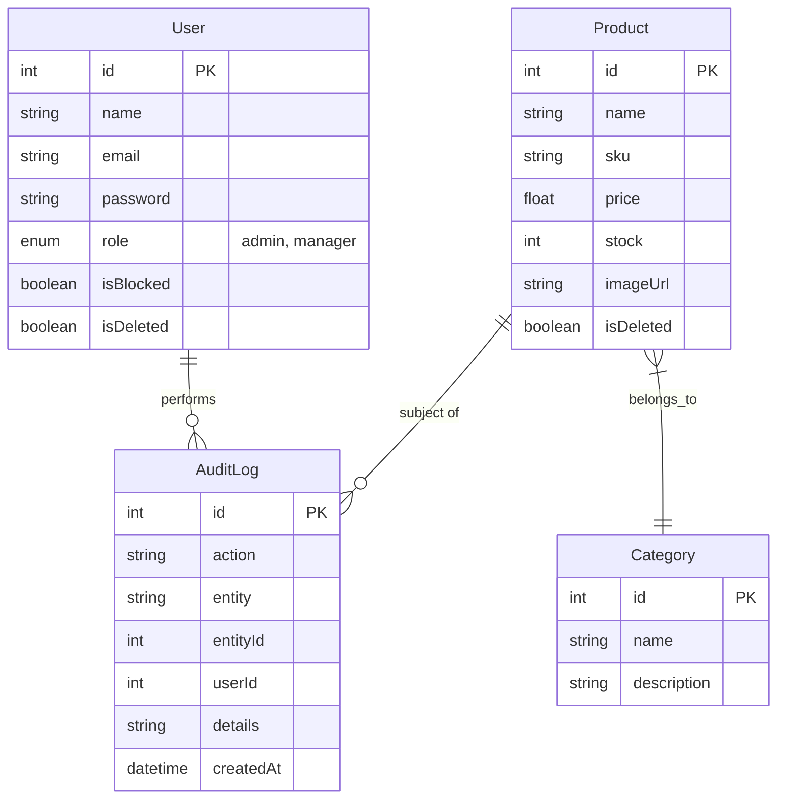

# Product Inventory Management System

A full-stack MERN (MySQL, Express, React, Node.js) application for managing product inventories with Role-Based Access Control (RBAC), Audit Logging, and Image Uploads.

## 🚀 Features
-   **Role-Based Access Control (RBAC):** Admin and Manager roles.
-   **Product Management:** Create, Read, Update, Delete (Soft Delete) products.
-   **Image Uploads:** Upload product images.
-   **Search & Filter:** Filter by category, stock status, and price range.
-   **Audit Logs:** Track all user actions (Create, Update, Delete, Login).
-   **Authentication:** Secure JWT authentication with httpOnly cookies.

## 🛠️ Tech Stack
-   **Frontend:** React (Vite), Tailwind CSS, React Router, Axios
-   **Backend:** Node.js, Express.js
-   **Database:** MySQL (Sequelize ORM)
-   **Tools:** Multer (Uploads), BCrypt (Security), JSONWebToken (Auth)

## 🗄️ Database Schema


## ⚙️ Setup Instructions

### 1. Database Setup
1.  Install MySQL.
2.  Create a database named `inventory_db`.
    ```sql
    CREATE DATABASE inventory_db;
    ```

### 2. Backend Setup
1.  Navigate to `backend/`.
2.  Create a `.env` file:
    ```env
    PORT=5000
    NODE_ENV=development
    DB_HOST=localhost
    DB_USER=root
    DB_PASS=your_mysql_password
    DB_NAME=inventory_db
    JWT_SECRET=your_secret_key
    FRONTEND_URL=http://localhost:5173
    ```
3.  Install dependencies and seed data:
    ```bash
    npm install
    npm run seed
    npm run dev
    ```
    *Default Admin:* `admin@example.com` / `admin123`

### 3. Frontend Setup
1.  Navigate to `frontend/`.
2.  Install dependencies and run:
    ```bash
    npm install
    npm run dev
    ```
3.  Open `http://localhost:5173`.

## 📡 API Documentation

### Auth
-   `POST /api/auth/login` - Login user
-   `POST /api/auth/logout` - Logout user

### Products
-   `GET /api/products` - Get all products (supports `?keyword=`, `?category=`, `?stockStatus=`)
-   `GET /api/products/:id` - Get single product
-   `POST /api/products` - Create product (Admin/Manager)
-   `PUT /api/products/:id` - Update product (Admin/Manager)
-   `DELETE /api/products/:id` - Soft delete product (Admin/Manager)
-   `PUT /api/products/:id/stock` - Update stock level

### Users (Admin Only)
-   `GET /api/users` - Get all users
-   `POST /api/users` - Create new user
-   `PUT /api/users/:id` - Update user
-   `PUT /api/users/:id/block` - Block/Unblock user

### Audit Logs (Admin Only)
-   `GET /api/audit` - View system activity logs

## 🌍 Deployment
See [Deployment Guide](./deployment_guide.md) for detailed instructions on deploying to Vercel, Render, and Aiven.
# Inventory-Management-System-assignment
